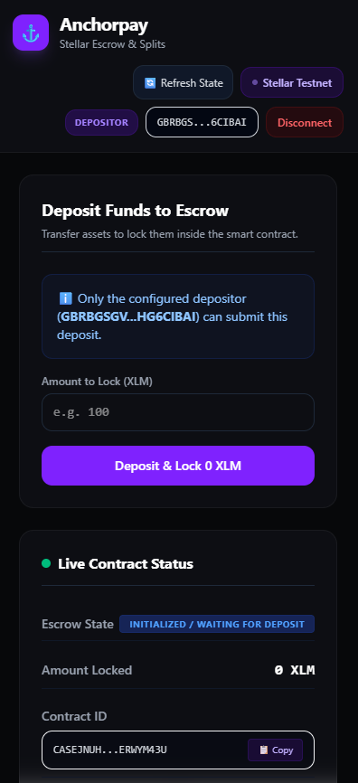
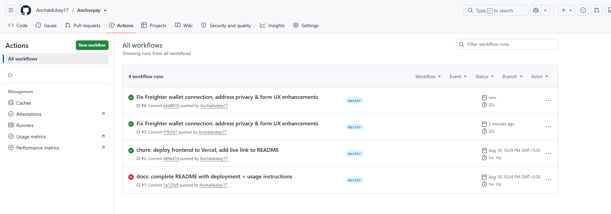
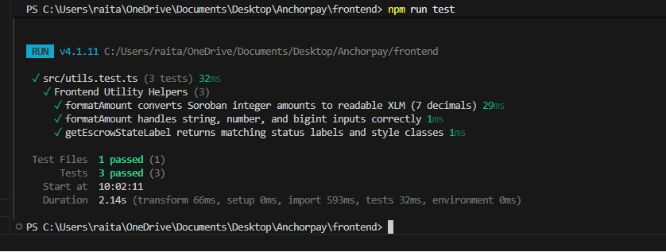
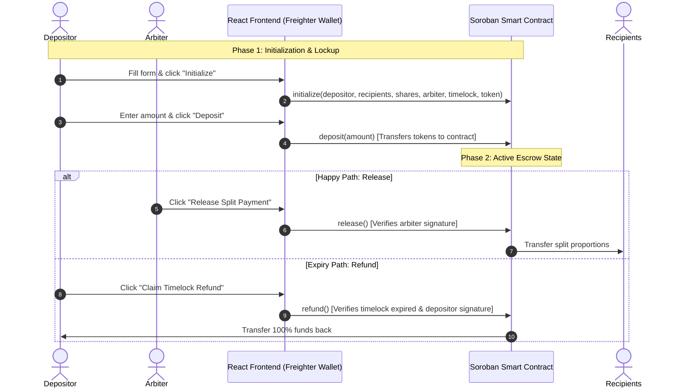

# Anchorpay: Stellar/Soroban Split-Payment Escrow DApp

[](https://github.com/Anchaldubey17/Anchorpay/actions)
[](https://opensource.org/licenses/MIT)

Decentralized split-payment escrow system built on the Stellar network using Soroban smart contracts.

---

## Live Demo 🔗

Live URL: **[https://anchorpay-chi.vercel.app](https://anchorpay-chi.vercel.app)**

---

## Problem / Motivation

Traditional escrow agreements are often slow, expensive, and lack automated trust when splits are involved. Anchorpay solves this by providing a decentralized escrow protocol on Stellar. A Depositor can securely lock funds inside the contract, designating splits for multiple Recipients. A neutral Arbiter verifies the conditions are met and releases the split payouts directly, or if the time lock expires, the Depositor safely reclaims their funds.

---

## Features

* **Freighter Wallet Integration**: Connect and authenticate securely using the standard Freighter browser extension.
* **Pre-flight Account Change Guard**: Automatically detects account switches in the Freighter extension, updates the dApp state, and prompts re-verification to prevent transaction signature errors.
* **Privacy Masking**: Conceals sensitive contract state and addresses behind a secure lock overlay until a wallet is connected.
* **Dynamic Splits Entry**: UI form supports dynamic recipient row addition and deletion (no comma-separated strings needed), ensuring weight matching and address validations.
* **Truncated Addresses & Clipboard Copy**: Truncates all public keys (Depositor, Arbiter, Recipients, Token ID) for clean presentation and provides secure one-click copy buttons.
* **Responsive Dark Theme UI**: Built with glassmorphic cards, smooth micro-animations, and a styled dark-theme calendar date picker.

---

## Contract Details

* **Network:** Stellar Testnet
* **Contract ID:** [`CAVL7PGQVTG43VLTNTEAGGKAEYNZT67X4RXWZWP25DATVCNMZN2CKTKB`](https://stellar.expert/explorer/testnet/contract/CAVL7PGQVTG43VLTNTEAGGKAEYNZT67X4RXWZWP25DATVCNMZN2CKTKB)
* **WASM Upload Hash:** `f8d6a91e14f942ed215bfad0ce85510945f68747f5248798f3b43ee30534f628`
* **Deployment Transaction:** [`3af2ff3d9f49ade54cd3622c45ed2808d5982924cf8d95a4a05b9189ff3e6f12`](https://stellar.expert/explorer/testnet/tx/3af2ff3d9f49ade54cd3622c45ed2808d5982924cf8d95a4a05b9189ff3e6f12)

---

## Screenshots

| Mobile UI | CI/CD Passing | Test Output |
|---|---|---|
|  |  |  |

---

## Demo Video 🎥


https://github.com/user-attachments/assets/246256c6-aec5-4f17-97c9-563f1b9f2d6c


---

## Architecture Flow



---

## Tech Stack

| Layer | Technology |
|---|---|
| **Smart Contract** | Rust, Soroban SDK (v26.1.1) |
| **Frontend Framework** | React, TypeScript, Vite |
| **Styling** | Tailwind CSS v4, Vanilla CSS (Custom Glassmorphism) |
| **Wallet Integration** | Freighter API (`@stellar/freighter-api`) |
| **Blockchain Client** | Stellar SDK (`@stellar/stellar-sdk` v16+) |
| **CI/CD** | GitHub Actions |
| **Hosting** | Vercel |

---

## Getting Started

### Prerequisites
* Rust & Cargo (v1.84.0+)
* Node.js (v20+) & npm
* A Freighter Wallet extension installed in your browser

### 1. Build Smart Contract
```bash
# Navigate to the contract folder
cd contract

# Build the WASM contract
stellar contract build
```
This generates the optimized contract file at `target/wasm32-unknown-unknown/release/anchorpay.wasm` (or `target/wasm32v1-none/release/anchorpay.wasm`).

### 2. Run React Frontend
```bash
# Navigate to the frontend folder
cd ../frontend

# Install node dependencies
npm install

# Run the local Vite dev server
npm run dev
```
Open **[http://localhost:5173](http://localhost:5173)** in your browser.

---

## Running Tests

### Smart Contract Tests
Run the Rust cargo test suite, which verifies splits distribution, timelock logic, access control, and error states:
```bash
cd contract
cargo test
```
**Expected Output:**
```text
running 3 tests
test test::test_errors ... ok
test test::test_escrow_refund_flow ... ok
test test::test_escrow_split_flow ... ok

test result: ok. 3 passed; 0 failed; 0 ignored; 0 measured; 0 filtered out; finished in 0.10s
```

### Frontend Utility Tests
Run Vitest to verify decimal conversion and state labelling:
```bash
cd frontend
npm test
```
**Expected Output:**
```text
✓ src/utils.test.ts (3 tests) 54ms

 Test Files  1 passed (1)
      Tests  3 passed (3)
```

---

## Contract Functions

| Function | Arguments | Description | Access Control |
|---|---|---|---|
| `initialize` | `depositor: Address`, `recipients: Vec<Address>`, `shares: Vec<u32>`, `arbiter: Address`, `timelock: u64`, `token: Address` | Sets configuration parameters and sets state to `Init`. | Unrestricted (once only) |
| `deposit` | `amount: i128` | Transfers assets from depositor to contract and changes state to `Deposited`. | `depositor` signature |
| `release` | *None* | Splits and transfers the locked amount to recipients based on weight, sets state to `Released`. | `arbiter` signature |
| `refund` | *None* | Reclaims all locked funds back to the depositor if the timelock has expired, sets state to `Refunded`. | `depositor` signature |
| `get_status` | *None* | Reads and returns the state, config, and amount locked. | Read-Only (Simulation) |

---

## Project Structure

```text
.
├── .github
│   └── workflows
│       └── ci.yml
├── args
├── bin
│   ├── stellar-cli.tar.gz
│   └── stellar.exe
├── contract
│   ├── src
│   │   ├── lib.rs
│   │   └── test.rs
│   ├── Cargo.lock
│   ├── Cargo.toml
│   └── deploy_info.json
├── frontend
│   ├── src
│   │   ├── assets
│   │   ├── contracts
│   │   │   └── anchorpay
│   │   │       ├── src
│   │   │       │   └── index.ts
│   │   │       ├── tsconfig.json
│   │   │       └── package.json
│   │   ├── App.tsx
│   │   ├── index.css
│   │   ├── main.tsx
│   │   ├── utils.ts
│   │   └── utils.test.ts
│   ├── index.html
│   ├── package-lock.json
│   ├── package.json
│   ├── tsconfig.json
│   └── vite.config.ts
└── README.md
```

---

## CI/CD

The GitHub Actions workflow (`.github/workflows/ci.yml`) runs automatically on push/pull requests to the `main` branch. It executes:
1. **Rust Check**: Verifies cargo builds and passes unit tests in `contract/`.
2. **Frontend Check**: Verifies typescript checking (`tsc`), lints the code (`oxlint`), and compiles the production bundle (`vite build`).

---

## Known Limitations

* **Testnet Only**: Built and deployed strictly for Stellar Testnet. Has not undergone a third-party security audit for mainnet release.

---

## License

This project is licensed under the MIT License - see the [LICENSE](LICENSE) file for details.
