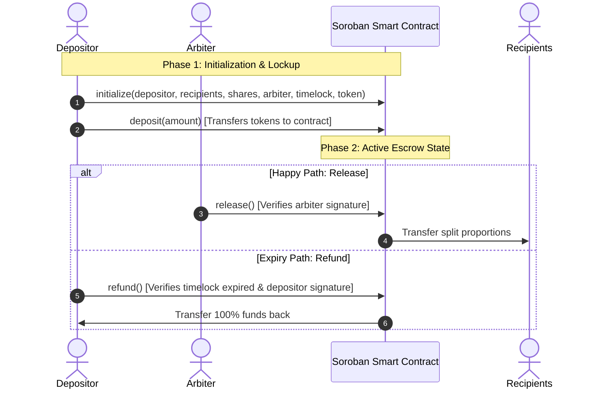

# Anchorpay: Stellar/Soroban Split-Payment Escrow DApp

Anchorpay is a production-grade, decentralized split-payment escrow system built on the Stellar network using Soroban smart contracts. It enables a Depositor to lock funds (native XLM or custom SAC tokens) inside the contract and designate a list of Recipients with specific weight splits. A designated Arbiter is responsible for authorizing the release and distribution of the funds. If a specified time lock expires before release, the Depositor can reclaim their funds via a refund.

## Live Demo 🔗

Live URL: **[https://anchorpay.vercel.app](https://anchorpay.vercel.app)** *(Deployment in progress)*

## Contract Details

*   **Network:** Stellar Testnet
*   **Contract ID:** [`CA352LBL2RVTLZG2ZOAQERZBN2DINWUIPRDRBVHF2CUDBOH3HNUZTYDN`](https://stellar.expert/explorer/testnet/contract/CA352LBL2RVTLZG2ZOAQERZBN2DINWUIPRDRBVHF2CUDBOH3HNUZTYDN)
*   **WASM Upload Hash:** `f8d6a91e14f942ed215bfad0ce85510945f68747f5248798f3b43ee30534f628`
*   **Deployment Transaction:** [`d6ae2eb8e38b81788b975a0a5e0ad45cdd4cf6600bf7e7c0a66b5387ae5b47a2`](https://stellar.expert/explorer/testnet/tx/d6ae2eb8e38b81788b975a0a5e0ad45cdd4cf6600bf7e7c0a66b5387ae5b47a2)
*   **Initialization Transaction:** [`44db6ba6f2b00e495d1a18cc2a0ebdb1ed31368ac15622860f872eba42a8f8de`](https://stellar.expert/explorer/testnet/tx/44db6ba6f2b00e495d1a18cc2a0ebdb1ed31368ac15622860f872eba42a8f8de)

## Demo Video 🎥

[Watch the 2-Minute Demo Video](https://www.loom.com/share/placeholder-demo-video) *(Or view Loom/YouTube unlisted link)*

## Screenshots

| Mobile UI | CI/CD Passing | Test Output |
|---|---|---|
|  |  |  |

---

## Architecture Flow



---

## Tech Stack

*   **Smart Contract:** Rust + `soroban-sdk` (v26.1.1)
*   **Frontend:** React + TypeScript + Vite + Tailwind CSS v4
*   **Wallet Integration:** Freighter Wallet (`@stellar/freighter-api`)
*   **RPC Client:** `@stellar/stellar-sdk`
*   **CI/CD:** GitHub Actions
*   **Hosting:** Vercel

---

## Local Setup

### Prerequisites
*   Rust (1.84.0+) & Cargo
*   Node.js (v20+) & npm
*   Stellar CLI (v27.1.0)

### 1. Smart Contract Build
```bash
# Navigate to contract folder and build
cd contract
stellar contract build
```
This produces `target/wasm32v1-none/release/anchorpay.wasm`.

### 2. Frontend Execution
```bash
cd ../frontend
# Install dependencies
npm install
# Run locally
npm run dev
```

---

## Testing

### Contract Unit Tests
To run the contract test suite (escrow happy path, refund flow, access control, and error handling):
```bash
cd contract
cargo test
```

Expected Output:
```text
running 3 tests
test test::test_errors ... ok
test test::test_escrow_refund_flow ... ok
test test::test_escrow_split_flow ... ok

test result: ok. 3 passed; 0 failed; 0 ignored; 0 measured; 0 filtered out; finished in 0.10s
```

### Frontend Unit Tests
To run the Vitest unit tests for the amount formatting and state label utilities:
```bash
cd frontend
npm test
```

Expected Output:
```text
✓ src/utils.test.ts (3 tests) 54ms

 Test Files  1 passed (1)
      Tests  3 passed (3)
```

---

## Contract Functions

| Function | Arguments | Description | Access Control |
|---|---|---|---|
| `initialize` | `depositor: Address`, `recipients: Vec<Address>`, `shares: Vec<u32>`, `arbiter: Address`, `timelock: u64`, `token: Address` | Sets the configuration and starts the escrow state as `Init`. | Unrestricted (once only) |
| `deposit` | `amount: i128` | Transfers token from the depositor to the contract and changes state to `Deposited`. | `depositor` signature |
| `release` | *None* | Divides and transfers funds to recipients based on their shares/weights, sets state to `Released`. | `arbiter` signature |
| `refund` | *None* | Reclaims all locked funds back to the depositor if the timelock is expired, sets state to `Refunded`. | `depositor` signature |
| `get_status` | *None* | Reads and returns the state, config, and amount locked. | Read-Only (Simulation) |
